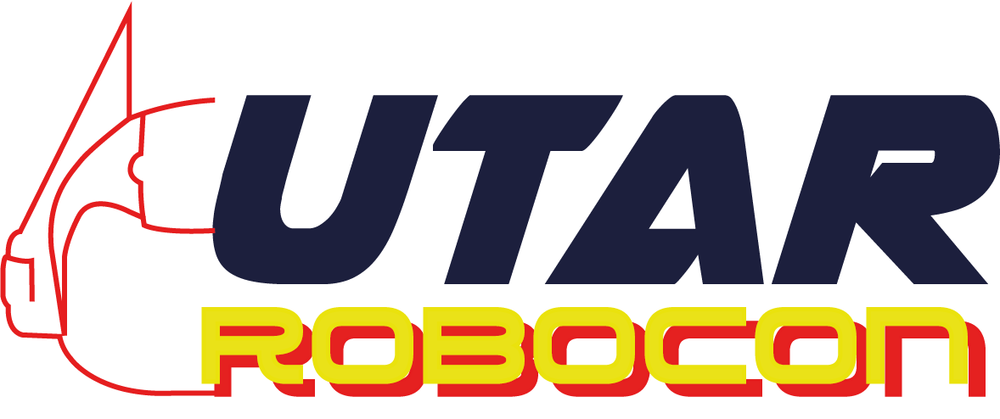

.. UTAR_ROBOCON_Team_Documentation documentation master file, created by
   sphinx-quickstart on Fri Jan 10 05:44:38 2025.
   You can adapt this file completely to your liking, but it should at least
   contain the root `toctree` directive.

Welcome to UTAR ROBOCON Team Documentation!
===========================================
This website shares the technology and techniques that UTAR ROBOCON Team uses to build, program, and control robots for competitions!

.. toctree::
   :maxdepth: 2
   :caption: Contents

   Contents/Mechanical/mech
   Contents/Fabrication/fab
   Contents/Electrical_and_Electronics/ene
   Contents/Software/soft

.. toctree::
   :maxdepth: 2
   :caption: Team Portfolio

   Team_Portfolio/portfolio

